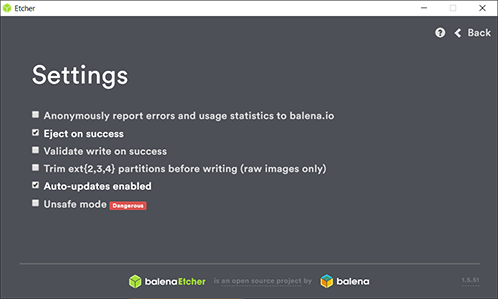

# PiCluster

 

This repository is the main entry point of resources for the Raspberry Pi cluster architecture for smart homes that was deployed as part of one of my Ph. D. thesis projects.

## Authors

* [**Florentin Thullier**](https://github.com/FlorentinTh) - 2019

## Prerequisites

Download the latest FlOS operating system image [here](https://github.com/FlorentinTh/FlOS/releases).

Flash your image on the SD card with the latest version of [Etcher](https://www.balena.io/etcher/) with the following parameters :

## Documentation

### Table of Contents

* [1. Cluster](docs/00-cluster.md)
  * [1.1. Create the Cluster](docs/00-cluster.md#1-create-the-cluster)
  * [1.2. Reverse Proxy](docs/00-cluster.md#2-reverse-proxy)
  * [1.3. Cluster Management GUI](docs/00-cluster.md#3-cluster-management-gUI)
  * [1.4. Private Registry](docs/00-cluster.md#4-private-registry)
  * [1.5. Versioning](docs/00-cluster.md#5-versioning)
* [2. Network File System](docs/10-nfs.md)
  * [2.1. Prerequisites](docs/10-nfs.md#1-prerequisites)
  * [2.2. NFS Server](docs/10-nfs.md#2-nfs-server)
    * [2.2.1. Initialization](docs/10-nfs.md#2.1-initialization)
    * [2.2.2. Creation & Configuration](docs/10-nfs.md#2.2-creation-&-configuration)
  * [2.3. NFS Clients](docs/10-nfs.md#3-nfs-clients)

### Annexes

* [1. Annex A. - Certificates](docs/80-certificates.md)
* [2. Annex B. - Disk Management](docs/90-disk-management.md)

## Related Repositories

* [**FlOS**](https://github.com/FlorentinTh/FlOS)
  > Repository of the operating system installed on every Raspberry Pi of the cluster.

* [**PiCluster-GUI**](https://github.com/FlorentinTh/PiCluster-GUI)
  > Repository of the GUI to interact with the Raspberry Pi cluster.

* [**PiCluster-Auth**](https://github.com/FlorentinTh/PiCluster-Auth)
  > Repository of an authentication module employed in the cluster.

* [**PiCluster-FeatureExtractor**](https://github.com/FlorentinTh/PiCluster-FeatureExtractor)
  > Repository of a feature extractor module employed in the cluster.

## License

This project is licensed under the Apache-2.0 License - see the [LICENSE](LICENSE) file for details.
