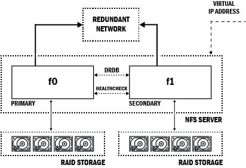

# High Availability Network File System

> If needed, it is possible to refer to [Annex B.](90-disk-management.md) in order to format an external drive.



## 1. Prerequisites

- Install an NTP client :

_On every node of the NFS file server._

```bash
$ sudo apt-get install -y ntp ntpdate
```

## 2. Install and Configure DRBD

- Install ```DRBD``` :

_On every node of the NFS file server._

```bash
$ sudo apt-get install -y drbd-utils
```

- Edit global configuration as follows :

_On every node of the NFS file server._

```bash
$ sudo nano /etc/drbd.d/global_common.conf

# insert this configuration :
global {
    usage-count yes;
}

common {
    protocol C;

    handlers {

        pri-on-incon-degr "/usr/lib/drbd/ \
        notify-pri-on-incon-degr.sh; /usr/lib/drbd/ \
        notify-emergency-reboot.sh; echo b > /proc/ \
        sysrq-trigger ; reboot -f";

        pri-lost-after-sb "/usr/lib/drbd/ \
        notify-pri-lost-after-sb.sh; /usr/lib/drbd/ \
        notify-emergency-reboot.sh; echo b > /proc/ \
        sysrq-trigger ; reboot -f";

        local-io-error "/usr/lib/drbd/notify-io-error.sh; \
         /usr/lib/drbd/notify-emergency-shutdown.sh; echo \
         o > /proc/sysrq-trigger ; halt -f";

        split-brain \
        "/usr/lib/drbd/notify-split-brain.sh root";
    }

    startup {
        wfc-timeout 15;
        degr-wfc-timeout 60;
    }
    net {
        cram-hmac-alg sha1;
    }
    syncer {
        rate 10M;
    }
}
```

- Create new ressources configuration as follows :

_On every node of the NFS file server._

```bash
$ sudo nano /etc/drbd.d/r0.res

# insert thi configuration :
resource r0 {
    net {
        shared-secret "<your_secret_here>";
    }

    on <first node hostname> {
        device    /dev/drbd0;
        disk      /dev/sda;
        address   192.168.1.50:7788;
        meta-disk internal;
    }

    on <second node hostname> {
        device    /dev/drbd0;
        disk      /dev/sda;
        address   192.168.1.51:7788;
        meta-disk internal;
    }
}
```

- Create metadata :

_On every node of the NFS file server._

```bash
$ sudo drbdadm create-md r0
```

- Enable the ressource :

_On every node of the NFS file server._

```bash
$ sudo drbdadm up r0
```

- Start ```DRBD``` :

_On every node of the NFS file server._

```bash
$ sudo /etc/init.d/drbd start
```

- Initialise a primary ```DRBD``` connection :

_Only on the first node of the NFS file server._

```bash
$ sudo drbdadm -- --overwrite-data-of-peer primary r0
```

- Start the synchronization :

_Only on the first node of the NFS file server._

```bash
$ sudo drbdadm disconnect r0
$ sudo drbdadm connect r0
```

> The status of the synchronization can be monitored through the following command : ```cat /proc/drbd```. The output should look as follows : 
> ```bash
> version: 8.4.10 (api:1/proto:86-101)
> srcversion: 9B4D87C5E865DF526864868
> 0: cs:SyncSource ro:Primary/Secondary
>    ds:UpToDate/Inconsistent C r-----
>    ns:43221960 nr:0 dw:0 dr:43298828
>    al:0 bm:0 lo:0 pe:3 ua:0 ap:0
>    ep:1 wo:f oos:19356128
>       [============>.......] sync'ed: 69.1% (18900/61108)M
>       finish: 0:55:43 speed: 5,784 (5,860) K/sec
> ```

## 3. Install and Configure NFS

- Install the NFS server :

_On every node of the NFS file server._

```bash
$ sudo apt-get install -y nfs-kernel-server
```

- Remove the system boot up links :

_On every node of the NFS file server._

```bash
$ sudo update-rc.d -f nfs-kernel-server remove
$ sudo update-rc.d -f nfs-common remove
```

- Create the NFS share folders structure :

_On every node of the NFS file server._

```bash
$ sudo mkdir -p /mnt/nfs
```

- Edit sharing configuration as follows :

_On every node of the NFS file server._

```bash
$ sudo nano /etc/exports

# add thi line at the end of the file :
/mnt/nfs 192.168.1.0/255.255.255.0(rw,no_root_squash,no_all_squash,sync)
```

## 4. Install and Configure Heartbeat

- Install ```Heartbeat``` :

_On every node of the NFS file server._

```bash
$ sudo apt-get install -y heartbeat
```

- Configure ```Heartbeat``` as follows :

_On every node of the NFS file server._

```bash
$ sudo nano /etc/heartbeat/ha.cf

# Insert the following configuration :
logfacility     local0
keepalive 2
deadtime 10
bcast   eth0
auto_failback off
node <hostname_of_first_node> <hostname_of_second_node>

$ sudo nano /etc/heartbeat/haresources

# Insert the following configuration :
<hostname_of_first_node> IPaddr::<your_virtual_ip>/<mask>/<interface> drbddisk::r0
Filesystem::/dev/drbd0::/mnt/nfs::ext4 nfs-kernel-server

$ sudo nano /etc/heartbeat/authkeys

# Insert the following configuration :
auth 1
1 sha1 <your_secret>

$ sudo chmod 600 /etc/heartbeat/authkeys
```

- Start the services on every nodes as follows :

```bash
$ sudo /etc/init.d/drbd start
$ sudo /etc/init.d/heartbeat start
```

## 5. Configure NFS information mirroring

- On the primary NFS server :

```bash
$ sudo mv /var/lib/nfs/ /mnt/nfs/.share
$ sudo ln -s /mnt/nfs/.share /var/lib/nfs
$ sudo /etc/init.d/heartbeat stop
```

- On the secondary NFS server _(that now became the new primary server)_ :

```bash
$ sudo rm -rf /var/lib/nfs/
$ sudo ln -s /mnt/nfs/.share /var/lib/nfs
```

- Finally, restart ```heartbeat``` on the old primary NFS server :

```bash
$ sudo /etc/init.d/heartbeat start
```
